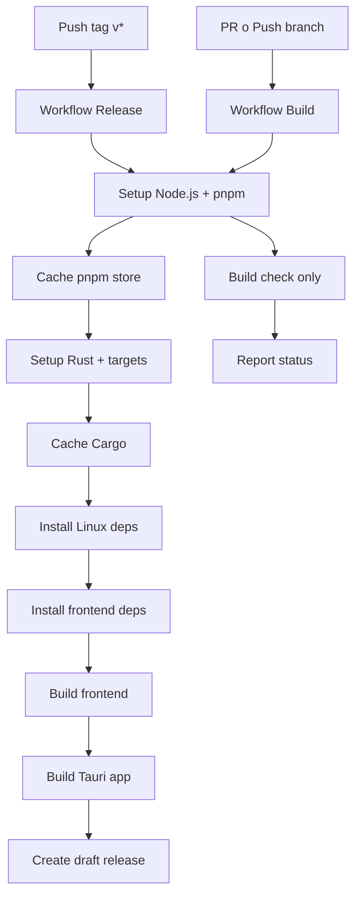

# Plan: GitHub Actions CI/CD para MeaCode Studio

## Objetivo

Configurar pipelines de CI/CD con GitHub Actions para compilar automáticamente la aplicación Tauri en múltiples plataformas y crear releases cuando se pushean tags.

## Archivos a crear/modificar

### 1. Crear estructura de workflows

- **`.github/workflows/release.yml`**: Workflow principal para builds y releases (se activa con tags `v*`)
- **`.github/workflows/build.yml`**: Workflow para verificar builds en PRs y pushes a branches principales
- **`.github/workflows/nightly.yml`**: Workflow comentado como referencia futura para builds nightly/beta

### 2. Actualizar configuración de Tauri

- **`src-tauri/tauri.conf.json`**: Cambiar `package.version` de `"0.1.0"` a `"0.0.0"` para que el action lo sobrescriba automáticamente

## Detalles de implementación

### Workflow de Release (`release.yml`)

- **Triggers**: Tags que empiezan con `v*` y `workflow_dispatch`
- **Concurrencia**: `release-${{ github.ref }}` con `cancel-in-progress: true`
- **Plataformas**: Windows, Linux, macOS (x86_64 y ARM64)
- **Optimizaciones**:
- Cache de pnpm con store path correcto
- Cache de Cargo (registry, git, target)
- Dependencias Linux actualizadas (webkit2gtk 4.1)
- **Configuración Tauri**:
- `projectPath: .` (raíz del proyecto)
- Release notes personalizados con características del IDE
- Draft release para revisión antes de publicar

### Workflow de Build (`build.yml`)

- **Triggers**: Pull requests y pushes a branches principales (excluye tags)
- **Concurrencia**: `build-${{ github.ref }}-${{ github.head_ref }}`
- **Plataformas**: Windows, Linux, macOS (solo x86_64 para PRs)
- **Propósito**: Verificar que el código compila sin crear releases
- **Mismas optimizaciones de cache** que el workflow de release

### Workflow Nightly (referencia futura)

- Archivo comentado con estructura para builds automáticos
- Listo para activar cuando se necesite canal nightly/beta

## Flujo de trabajo




## Cambios específicos

### `src-tauri/tauri.conf.json`

```json
"package": {
  "productName": "MeaCode Studio",
  "version": "0.0.0"  // Cambiar de "0.1.0" a "0.0.0"
}
```


### Estructura de directorios

```javascript
.github/
  workflows/
    release.yml    (nuevo)
    build.yml      (nuevo)
    nightly.yml    (nuevo, comentado)
```


## Beneficios

- Builds más rápidos gracias a cache de Cargo y pnpm
- Prevención de builds duplicados con control de concurrencia
- Versionado automático desde tags
- Verificación automática en PRs
- Preparado para escalar a canales nightly/beta/stable

## Testing

Después de implementar, probar con:

1. Crear un tag de prueba: `git tag v0.1.0-test && git push origin v0.1.0-test`